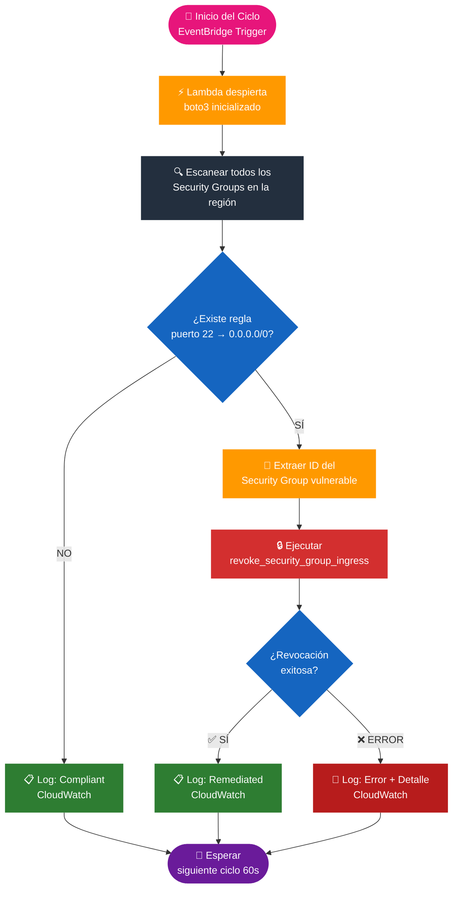

# 🏛️ System Architecture

Este documento detalla la topología y el flujo de datos del sistema de auto-remediación.

---

## 🔄 Flujo de Datos (Workflow)

1. **Activación:** EventBridge dispara un evento cada 60 segundos (Cron).
2. **Ejecución:** AWS Lambda se despierta e invoca el SDK `boto3`.
3. **Filtrado:** La función solicita a la API de EC2 todos los Security Groups con el puerto 22 abierto a `0.0.0.0/0`.
4. **Remediación:** Si encuentra coincidencias, ejecuta `revoke_security_group_ingress`.
5. **Audit Log:** El resultado (éxito/error) se persiste en **CloudWatch Logs**.

---

## 🧭 Flujo de Decisión (Decision Flow)

---

## 🛡️ Capas de Seguridad

* **IAM Least Privilege:** La Lambda solo tiene permisos para `Describe` y `Revoke` en EC2. No puede crear ni borrar instancias.
* **State Locking:** Terraform utiliza DynamoDB para evitar que dos personas modifiquen la infraestructura al mismo tiempo.

---

[← Volver al README](./README.md)
