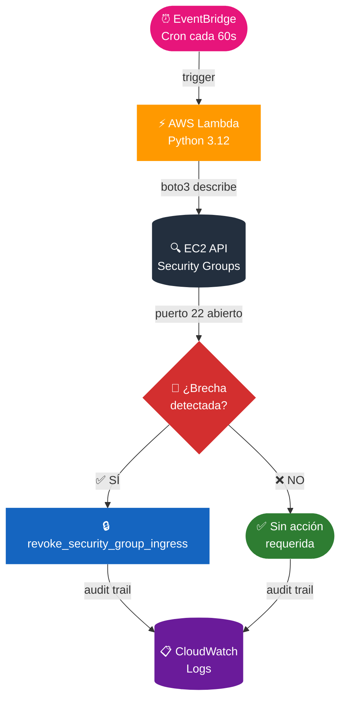

# 🛡️ AWS Cloud Self-Healing & Continuous Compliance

Sistema automatizado de **Remediación en Tiempo Real** para infraestructuras en la nube. Este proyecto implementa un bucle de reconciliación (Reconciliation Loop) que detecta y corrige brechas de seguridad en Security Groups de AWS de forma automática.

---

## 🎯 El Problema

Las configuraciones erróneas en la nube (Security Drift) son la causa principal de brechas de datos. Un puerto SSH (22) abierto al mundo (`0.0.0.0/0`) puede ser explotado en minutos.

## 💡 La Solución

Una arquitectura **Serverless & Event-Driven** que:

* **Monitorea:** Auditoría continua mediante EventBridge (Schedules).
* **Analiza:** Lógica en Python (Lambda) para identificar reglas inseguras.
* **Actúa:** Remediación inmediata mediante SDK Boto3.
* **Gobierna:** Infraestructura 100% modular con Terraform.

---

## 🏗️ Arquitectura del Sistema

> El detalle técnico completo de componentes y capas de seguridad se encuentra en:
> 👉 [ARCHITECTURE.md](./ARCHITECTURE.md)

---

## 🛠️ Stack Tecnológico

* **Infraestructura:** Terraform (Modules, Remote State, DynamoDB Locking).
* **Compute:** AWS Lambda (Python 3.12).
* **Observabilidad:** Amazon EventBridge & CloudWatch Logs.
* **Automation:** Bash Scripts (CI/CD ready).

---

## 📘 Guía de Operación (Runbook)

Para desplegar, probar y limpiar este laboratorio sin errores:
👉 [RUNBOOK.md](./RUNBOOK.md)

---

## 🤝 Contacto & Colaboración

¿Te interesa el SRE y la Automatización? ¡Conectemos!

* **Nombre:** Jose Garagorry
* **LinkedIn:** [linkedin.com/in/tu-perfil](https://linkedin.com/in/tu-perfil)
* **Portfolio:** [SoftrainCorp / GitHub](https://github.com/tu-usuario)
* **Ubicación:** Santiago, Chile 🇨🇱

---

## 🤝 Contacto & Colaboración

¿Te interesa el SRE y la Automatización? ¡Conectemos!

* **Nombre:** Jose Garagorry
* **LinkedIn:** [linkedin.com/in/jgaragorry](https://linkedin.com/in/jgaragorry)
* **Portfolio:** [Jose Garagorry/ GitHub](https://github.com/jgaragorry)
* **Ubicación:** Santiago, Chile 🇨🇱

---

*Desarrollado con mentalidad SRE: Si lo haces más de dos veces, automatízalo.*# 🛡️ AWS Cloud Self-Healing & Continuous Compliance
